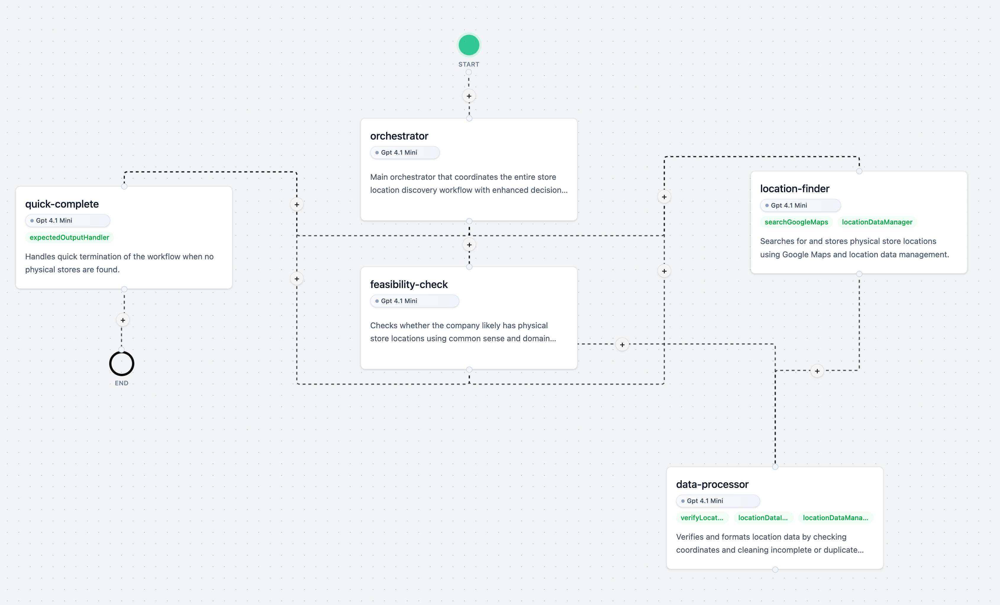

# Evolutionary Optimization of Multi-Agent Workflows

[](https://www.typescriptlang.org/)
[](https://nodejs.org/)
[](https://nextjs.org/)
[](docs/badges/tests.svg)
[](LICENSE)



Current multi-agent frameworks require manual workflow design, taking hours to configure and lacking native optimization capabilities. This creates a bottleneck: you know what problem to solve but not how agents should collaborate to solve it efficiently.

This framework automatically discovers and optimizes multi-agent workflows through evolutionary algorithms, eliminating manual configuration while providing full observability of the optimization process.

## Three Core Differentiators

**1. Built for Optimization**  
Genetic programming and cultural evolution automatically discover optimal agent collaboration patterns, tool usage, and workflow structures.

**2. 30-Second Deployment**  
JSON-based workflow definitions enable immediate deployment without coding agent interactions or setting up complex infrastructures.

**3. Complete Observability**  
Real-time visualization of workflow execution, evolutionary progress, and performance metrics across all optimization dimensions.

## Installation

```bash
# Clone and install dependencies at the repo root
git clone <repository-url>
cd lucky
bun install

# (Optional) Create environment file(s) where needed
# For the web app, create app/.env and set your API keys (e.g., OpenAI, Supabase)

# Start the web interface (from app/)
cd app && bun dev
```

## How It Works

The system treats AI agent workflows as evolvable data structures. Instead of manually coding agent interactions, you define workflows in JSON that the system can automatically improve through:

1. **Cultural Learning**: Iterative analysis and improvement of individual workflows
2. **Genetic Programming**: Population-based evolution with crossover and mutation
3. **Agent Handoffs**: Automatic routing between specialized agents based on task context
4. **Tool Integration**: Automatic discovery and use of 17+ tool categories

## Architecture

### Core Module

- **Workflow Engine**: Graph-based execution with message passing
- **Node Network**: Autonomous AI agents with tool access
- **Tool Registry**: Unified interface for code tools and external services
- **Memory Manager**: Context preservation and data summarization

### Optimization Module

- **Genetic Programming**: Population-based workflow evolution
- **Cultural Learning**: Knowledge preservation across generations
- **Fitness Evaluator**: Multi-dimensional performance assessment (accuracy, cost, time)
- **Mutation/Crossover**: LLM-powered semantic operations

## Usage

Instead of manually designing workflows, provide a small dataset of question-answer pairs. The system automatically discovers optimal workflows through evolutionary optimization.

```typescript
import { Workflow } from "@core/workflow/Workflow"

// Define a custom Tool
const verifyLocation = (locationInput: string) => {
  // Verify locations with external API
  return API.call("location-verify", locationInput)
}

// Create workflow with training dataset
const workflow = await Workflow.create(
  {
    goal: "Find all physical stores of a company",
    customTools: [verifyLocation],
    mcpTools: ["browserUse", "firecrawl"],
  },
  "JSON with store addresses and business details",
  [
    {
      question: "Find all Patagonia stores in the Netherlands",
      expectedAnswer: {
        addresses: ["Singel 465, Amsterdam"],
      },
    },
  ]
)

// Train with different algorithms and budgets
await workflow.train({
  type: "genetic", // or iterative
  budget: { generations: 10, populationSize: 20 },
})

// Execute optimized workflow
const result = await workflow.execute(
  "Find all Tony Chocolonely locations in the Netherlands"
)

// Output:
console.log(result)

// {
//   addresses: ["Oudebrugsteeg 15", "Danzigerkade 23B"],
// }
```

## Development

```bash
# Start the web app (from app/)
cd app && bun dev

# Run e2e/essential tests (from repo root)
bun run test:gate

# TypeScript type checking (from app/)
cd app && bun run tsc

# (Optional) Run app-specific unit tests
cd app && bun run test
```

## Optimization Algorithms

The framework implements two primary optimization approaches:

**Genetic Programming**: Population-based evolution with semantic crossover and mutation operations on workflow structures, agent prompts, and tool selections. Fitness evaluation across accuracy, cost, and execution time dimensions.

**Cultural Evolution**: Iterative improvement through analysis-driven mutations that preserve successful patterns while exploring variations in agent roles, tool usage, and inter-agent communication protocols.

## Development Roadmap

### System Robustness

- [ ] Message contracts and validation (priority 2)
- [ ] Partial workflow execution from dashboard (priority 1)
- [ ] Deterministic node execution modes

### Observability Infrastructure

- [ ] Full node trace export as JSONL (priority 1)
- [ ] Single node execution and debugging (priority 3)
- [ ] OpenTelemetry integration (priority 4)
- [ ] Real-time evolutionary progress visualization

### Optimization Capabilities

- [ ] Multi-armed bandit algorithms for exploration-exploitation balance
- [ ] Fine-grained evolutionary analysis and mutation strategies
- [ ] Semantic mutation effectiveness optimization
- [ ] Cross-workflow knowledge transfer

### Tool Integration

- [ ] Shared tool knowledge base across workflows
- [ ] 3-second MCP tool integration via visual dashboard
- [ ] Workflow-to-MCP conversion for composability
- [ ] Parallel multi-message node communication

## Research Contribution

This framework provides the first research testbed for evolution-guided workflow discovery in non-sandboxed environments. Key contributions:

- **Zero-Code Workflow Evolution**: JSON-based workflows that genetic programming can automatically optimize
- **Runtime Optimization**: Cultural evolution and genetic programming during execution
- **Real-World Tool Integration**: Support for actual coding tools beyond sandboxed environments
- **Comprehensive Research Infrastructure**: Genealogy tracking, fitness evaluation, and evolutionary analysis

The framework enables study of self-optimizing agentic workflows, bridging the gap between research automation and practical optimization while reducing manual maintenance requirements.

## License

CC BY-NC 4.0 - see [LICENSE](LICENSE) for details.
