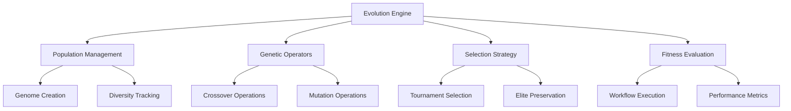

# Genetic Programming Module

Evolutionary workflow system that uses Large Language Models to evolve autonomous AI agent workflows through genetic programming principles.

## Quick Start

```typescript
import { EvolutionEngine } from "./evolutionengine"

// Create evolution configuration
const config = EvolutionEngine.createDefaultConfig({
  populationSize: 20,
  generations: 10,
  maxCost: 100,
  eliteSize: 2,
})

// Initialize engine
const engine = new EvolutionEngine(config)

// Define evaluation function
const evaluator = {
  async evaluate(genome) {
    // Execute workflow and return fitness metrics
    const result = await executeWorkflow(genome)
    return {
      success: result.success,
      executionTime: result.time,
      cost: result.cost,
      details: result.output,
    }
  },
}

// Run evolution
const result = await engine.evolveSimple(
  "Create a workflow that analyzes customer feedback and extracts sentiment",
  evaluator
)

console.log(`Best fitness: ${result.bestGenome.fitness}`)
console.log(`Evolution completed in ${result.generations} generations`)
```

## Architecture Overview

The system implements a **μ+λ evolutionary strategy** where workflows compete for survival based on execution performance, combining traditional genetic programming with modern LLM capabilities.



## Core Components

### Evolution Engine (`evolutionengine.ts`)

**Central orchestrator** managing the complete evolutionary process:

- **Population Initialization**: Creates diverse initial workflows using LLM
- **Evolution Loop**: Iterative evaluation → selection → reproduction → survival
- **Termination Management**: Cost limits, time constraints, convergence detection
- **Resource Management**: Rate limiting, budget controls, parallel evaluation

```typescript
// Evolution loop structure
for (let generation = 0; generation < maxGenerations; generation++) {
  // 1. Evaluate population fitness
  const scores = await evaluatePopulation(population)

  // 2. Select parents for reproduction
  const parents = await selectParents(population, scores)

  // 3. Create offspring through genetic operators
  const offspring = await produceOffspring(parents)

  // 4. Combine and select survivors (μ+λ strategy)
  population = await selectSurvivors([...population, ...offspring])

  // 5. Check termination criteria
  if (shouldTerminate(population, scores)) break
}
```

### Genome Management (`Genome.ts`)

**Workflow-Evolution Bridge** combining executable workflows with evolutionary metadata:

```typescript
interface WorkflowGenome extends Workflow {
  evolutionId: string // Unique evolution identifier
  generation: number // Generation number
  parentIds?: string[] // Lineage tracking
  createdAt: Date // Creation timestamp
  operation?: string // Genetic operation used
  fitness?: number // Performance score
}
```

**Key Operations**:

- `createRandom()` - LLM-based genome generation from text goals
- `hashGenome()` - SHA-256 hashing for deduplication
- `calculateSimilarity()` - Structural similarity metrics
- `generateFingerprint()` - Multi-dimensional genome characterization

### Genetic Operators

#### Crossover (`operators/crossover/Crossover.ts`)

**LLM-Powered Recombination** that semantically combines parent workflows:

```typescript
async function crossover(parent1: WorkflowGenome, parent2: WorkflowGenome): Promise<WorkflowGenome> {
  // Send both parents to LLM with crossover instructions
  const prompt = `
    Analyze these two successful workflows and create a hybrid offspring that combines 
    the best elements from both parents while maintaining functional coherence.
    
    Parent 1: ${JSON.stringify(parent1.config)}
    Parent 2: ${JSON.stringify(parent2.config)}
    
    Create a new workflow that inherits successful patterns from both parents.
  `

  const offspring = await Messages.sendAIRequest(prompt)
  return validateAndReturnGenome(offspring)
}
```

**Features**:

- Semantic understanding of workflow components
- Statistical success rate tracking
- Comprehensive error handling with retry logic
- Parent fitness correlation analysis

#### Mutations (`operators/Mutations.ts`)

**Intelligent Modifications** with multiple strategies and intensities:

**Available Mutation Types:**

- `operators/mutations/promptMutation.ts` - AI-powered prompt refinement
- `operators/mutations/toolMutation.ts` - Tool assignment changes
- `operators/mutations/structureMutation.ts` - Workflow structure modifications
- `operators/mutations/nodeOperations.ts` - Node-level operations
- `operators/mutations/modelMutation.ts` - Model selection changes

```typescript
// Mutation strategies
enum MutationType {
  PROMPT_REFINEMENT = "prompt", // Modify task descriptions
  PARAMETER_ADJUSTMENT = "parameter", // Adjust node parameters
  STRUCTURAL_CHANGE = "structural", // Add/remove/reorganize nodes
  TOOL_SUBSTITUTION = "tool", // Change tool assignments
}

// Mutation intensities
enum MutationIntensity {
  LIGHT = "light", // Minor refinements
  MEDIUM = "medium", // Moderate changes
  HEAVY = "heavy", // Substantial modifications
}
```

**Advanced Features**:

- Multi-type parallel mutations
- Adaptive intensity based on population dynamics
- Context-aware modifications using LLM understanding
- Comprehensive mutation success tracking

### Selection Strategy (`Select.ts`)

**Tournament Selection with Elitism**:

```typescript
// Selection configuration
interface SelectionConfig {
  tournamentSize: number // Tournament participants (default: 3)
  eliteSize: number // Elite preservation count (default: 2)
  crossoverRate: number // Crossover probability (default: 0.6)
  mutationRate: number // Mutation probability (default: 0.4)
}

// Tournament selection process
function selectParents(population: WorkflowGenome[], scores: FitnessScore[]): WorkflowGenome[] {
  const parents: WorkflowGenome[] = []

  for (let i = 0; i < requiredParents; i++) {
    // Random tournament
    const tournament = sampleRandom(population, tournamentSize)
    const winner = tournament.reduce((best, current) => (scores[current.id] > scores[best.id] ? current : best))
    parents.push(winner)
  }

  return parents
}
```

### Population Management (`Population.ts`)

**Comprehensive Population Operations**:

- **Initialization**: Parallel diverse genome generation
- **Statistics**: Fitness distributions, diversity metrics, convergence indicators
- **Diversity Management**: Similarity detection, pruning, active diversity injection
- **Health Monitoring**: Population quality assessment and maintenance

```typescript
// Population statistics
interface PopulationStats {
  bestFitness: number
  averageFitness: number
  worstFitness: number
  fitnessStdDev: number
  diversityIndex: number
  convergenceRate: number
  evaluationsPerHour: number
}
```

## Configuration Guide

### Basic Configuration

```typescript
const config: EvolutionConfig = {
  populationSize: 20, // Number of genomes in population
  generations: 10, // Maximum generations
  eliteSize: 2, // Elite preservation count
  tournamentSize: 3, // Tournament selection size
  crossoverRate: 0.6, // Crossover probability
  mutationRate: 0.4, // Mutation probability
  maxCost: 100, // Budget limit (USD)
  maxEvaluationsPerHour: 50, // Rate limiting
  timeLimit: 24 * 60 * 60 * 1000, // 24 hours in milliseconds
  convergenceThreshold: 0.001, // Fitness improvement threshold
  stagnationGenerations: 5, // Generations without improvement
}
```

### Advanced Configuration

```typescript
// Custom fitness evaluation
const evaluator: EvolutionEvaluator = {
  async evaluate(genome: WorkflowGenome): Promise<EvaluationResult> {
    try {
      // Execute workflow
      const execution = await executeWorkflow(genome)

      // Multi-dimensional fitness calculation
      const fitness = calculateFitness({
        success: execution.success,
        accuracy: execution.accuracy,
        efficiency: execution.time / execution.cost,
        robustness: execution.errorRate,
      })

      return {
        success: execution.success,
        fitness: fitness,
        executionTime: execution.time,
        cost: execution.cost,
        details: execution.output,
        metrics: {
          accuracy: execution.accuracy,
          efficiency: fitness.efficiency,
          robustness: fitness.robustness,
        },
      }
    } catch (error) {
      return {
        success: false,
        fitness: 0,
        executionTime: 0,
        cost: 0.01, // Minimal cost for failed evaluation
        details: error.message,
      }
    }
  },
}
```

## Performance Optimization

### Parallel Evaluation

```typescript
// Batch evaluation configuration
const batchConfig = {
  batchSize: 5, // Concurrent evaluations
  retryAttempts: 3, // Retry failed evaluations
  timeout: 300000, // 5 minute timeout
  rateLimitBuffer: 1000, // Rate limit buffer (ms)
  costThreshold: 0.5, // Halt if single evaluation > $0.50
}

// Enable parallel evaluation
engine.enableParallelEvaluation(batchConfig)
```

### Memory Management

```typescript
// Genome caching and cleanup
const memoryConfig = {
  maxCacheSize: 1000, // Maximum cached genomes
  cleanupInterval: 100, // Cleanup every N generations
  persistBestGenomes: true, // Keep elite genomes in memory
  compressHistoricalData: true, // Compress old generation data
}
```

## Monitoring and Debugging

### Real-time Monitoring

```typescript
// Evolution progress tracking
engine.onGenerationComplete((stats) => {
  console.log(`Generation ${stats.generation}:`)
  console.log(`Best Fitness: ${stats.bestFitness}`)
  console.log(`Average Fitness: ${stats.averageFitness}`)
  console.log(`Diversity Index: ${stats.diversityIndex}`)
  console.log(`Total Cost: $${stats.totalCost}`)
})

// Individual evaluation tracking
engine.onEvaluationComplete((result) => {
  if (result.success) {
    console.log(`✓ Genome ${result.genomeId}: ${result.fitness}`)
  } else {
    console.log(`✗ Genome ${result.genomeId}: ${result.error}`)
  }
})
```

### Debug Mode

```typescript
// Enable comprehensive debugging
const debugConfig = {
  verbose: true, // Detailed logging
  saveAllGenomes: true, // Persist all genomes
  trackLineage: true, // Full genealogy tracking
  evaluationDetails: true, // Detailed evaluation logs
  geneticOperatorLogs: true, // Crossover/mutation details
}

engine.enableDebugMode(debugConfig)
```

## Testing and Validation

### Unit Testing

```typescript
import { setupGPTestMocks } from "@/__tests__/shared"

describe("EvolutionEngine", () => {
  const { runService, verificationCache } = setupGPTestMocks()

  it("should initialize population correctly", async () => {
    const engine = new EvolutionEngine(defaultConfig)
    const population = await engine.initializePopulation("test goal")

    expect(population).toHaveLength(defaultConfig.populationSize)
    expect(population[0]).toHaveProperty("evolutionId")
    expect(population[0]).toHaveProperty("generation", 0)
  })
})
```

### Integration Testing

```typescript
// End-to-end evolution test
describe("Evolution Integration", () => {
  it("should complete full evolution cycle", async () => {
    const mockEvaluator = {
      evaluate: vi.fn().mockResolvedValue({
        success: true,
        fitness: 0.8,
        executionTime: 1000,
        cost: 0.05,
      }),
    }

    const result = await engine.evolveSimple("test goal", mockEvaluator)

    expect(result.bestGenome.fitness).toBeGreaterThan(0)
    expect(result.generations).toBeGreaterThan(0)
    expect(result.totalCost).toBeLessThan(config.maxCost)
  })
})
```

## Database Integration

### Evolution Run Tracking

```typescript
// Database schema for evolution runs
interface EvolutionRun {
  runId: string
  goal: string
  config: EvolutionConfig
  startTime: Date
  endTime?: Date
  status: "running" | "completed" | "failed"
  bestGenomeId?: string
  totalCost: number
  totalGenerations: number
}

// Generation tracking
interface EvolutionGeneration {
  generationId: string
  runId: string
  generationNumber: number
  populationSize: number
  bestFitness: number
  averageFitness: number
  diversityIndex: number
  completedAt: Date
}
```

### Data Persistence

```typescript
// Auto-save configuration
const persistenceConfig = {
  saveInterval: 5, // Save every 5 generations
  saveEliteGenomes: true, // Always save top performers
  compressGenomes: true, // Compress genome data
  retentionPeriod: 30, // Keep data for 30 days
  exportFormat: "json", // Export format
}

engine.enablePersistence(persistenceConfig)
```

## Best Practices

### 1. Population Size Guidelines

- **Small problems**: 10-20 genomes
- **Medium problems**: 20-50 genomes
- **Large problems**: 50-100+ genomes
- **Rule of thumb**: 10x the number of workflow nodes

### 2. Evaluation Strategy

- **Fast evaluation**: Prioritize quick feedback over perfect accuracy
- **Incremental testing**: Start with simple test cases, add complexity
- **Error handling**: Always return valid fitness scores, even for failures
- **Cost monitoring**: Track evaluation costs to prevent budget overruns

### 3. Genetic Operator Tuning

- **Crossover rate**: 0.6-0.8 for most problems
- **Mutation rate**: 0.2-0.4 for exploration
- **Elite size**: 10-20% of population
- **Tournament size**: 3-5 for balanced selection pressure

### 4. Convergence Management

- **Diversity monitoring**: Track population diversity metrics
- **Stagnation detection**: Stop after N generations without improvement
- **Adaptive parameters**: Adjust mutation rates based on convergence
- **Restart mechanisms**: Reinitialize population if stuck in local optima

## Troubleshooting

### Common Issues

#### Issue: Population converging too quickly

**Solution**: Increase mutation rate, reduce selection pressure, add diversity injection

```typescript
config.mutationRate = 0.6 // Increase exploration
config.tournamentSize = 2 // Reduce selection pressure
config.diversityThreshold = 0.8 // Force diversity maintenance
```

#### Issue: Evolution not improving

**Solution**: Check evaluation function, increase population size, adjust operators

```typescript
// Verify evaluation is working
const testResult = await evaluator.evaluate(testGenome)
console.log("Test evaluation:", testResult)

// Increase exploration
config.populationSize = 50
config.generations = 20
```

#### Issue: Evaluation timeouts

**Solution**: Implement timeout handling, reduce complexity, optimize evaluation

```typescript
// Add timeout to evaluation
const evaluateWithTimeout = async (genome) => {
  return Promise.race([
    evaluator.evaluate(genome),
    new Promise((_, reject) => setTimeout(() => reject(new Error("Evaluation timeout")), 30000)),
  ])
}
```

## Advanced Features

### Custom Genetic Operators

```typescript
// Implement custom crossover
class CustomCrossover {
  async crossover(parent1: WorkflowGenome, parent2: WorkflowGenome): Promise<WorkflowGenome> {
    // Custom crossover logic
    const hybridConfig = this.combineConfigs(parent1.config, parent2.config)
    return this.createOffspring(hybridConfig, [parent1.evolutionId, parent2.evolutionId])
  }
}

// Register custom operator
engine.registerCrossoverOperator(new CustomCrossover())
```

### Multi-objective Optimization

```typescript
// Multi-objective fitness function
const multiObjectiveEvaluator = {
  async evaluate(genome: WorkflowGenome): Promise<EvaluationResult> {
    const result = await executeWorkflow(genome)

    // Multiple fitness objectives
    const objectives = {
      accuracy: result.accuracy,
      speed: 1.0 / result.executionTime,
      cost: 1.0 / result.cost,
      robustness: result.successRate,
    }

    // Weighted combination or Pareto ranking
    const fitness = this.calculateParetoFitness(objectives)

    return { ...result, fitness, objectives }
  },
}
```

## File Structure

```
/gp
├── evolutionengine.ts          # Main evolution orchestrator
├── Genome.ts                   # Workflow genome management
├── Population.ts               # Population management and statistics
├── Select.ts                   # Selection algorithms
├── RunService.ts              # Evolution run persistence
├── operators/
│   ├── Mutations.ts           # Main mutation controller
│   ├── memoryPreservation.ts  # Memory handling during evolution
│   ├── crossover/
│   │   ├── Crossover.ts       # LLM-powered crossover operations
│   │   ├── crossoverPrompts.ts # Crossover prompting strategies
│   │   └── crossoverStrategy.ts # Crossover execution logic
│   └── mutations/
│       ├── index.ts           # Mutation type exports
│       ├── promptMutation.ts  # Prompt refinement mutations
│       ├── toolMutation.ts    # Tool assignment mutations
│       ├── structureMutation.ts # Structure modification mutations
│       ├── nodeOperations.ts  # Node-level operations
│       └── modelMutation.ts   # Model selection mutations
├── resources/
│   ├── types.ts              # Core type definitions
│   ├── gp.types.ts           # GP-specific types
│   ├── stats.ts              # Statistics calculations
│   ├── tracker.ts            # Evolution tracking
│   ├── utils.ts              # Utility functions
│   ├── wrappers.ts           # API wrappers
│   └── debug/                # Debug utilities
└── __tests__/                # Comprehensive test suite
```

## Related Documentation

- [RunService](./RunService.ts) - Evolution database persistence
- [Core Tools](../../tools/README.md) - Available tools for workflows
- [Workflow System](../../workflow/README.md) - Workflow execution engine
- [Core Messages](../../messages/README.md) - AI communication system
- [Testing Infrastructure](../../../__tests__/shared/README.md) - Test utilities
